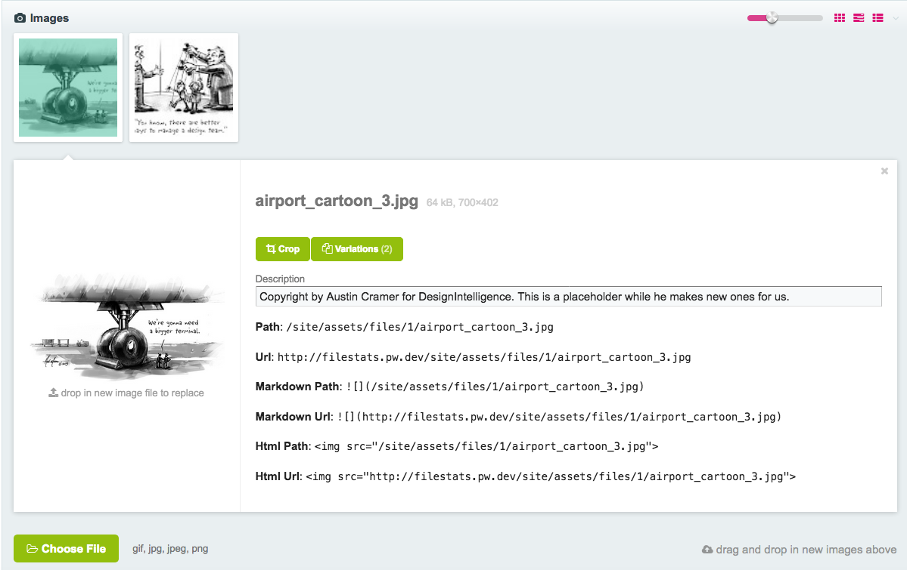
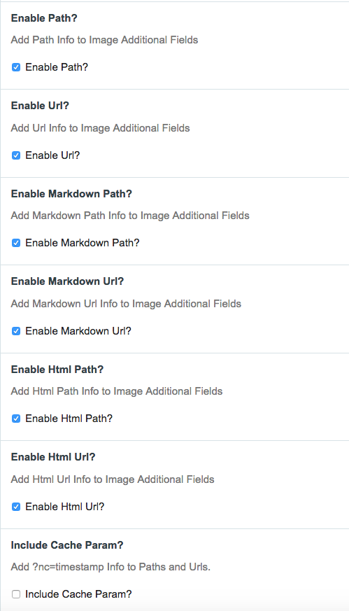

# InputfieldImageMarkdownCodeAdditionalFields
Adds information to image fields. Helpful when using the markdown editor in text fields.

You can configure what information should appear.

Made with <i class="fa fa-heart">&#9829;</i> by <a href="http://ninjas.cl" target="_blank">Ninjas</a>.